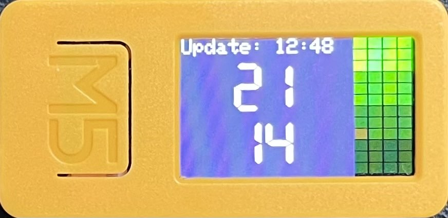
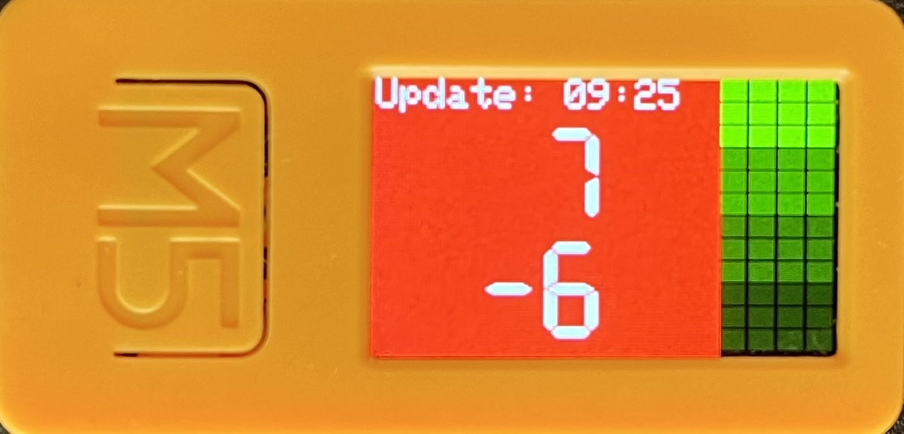
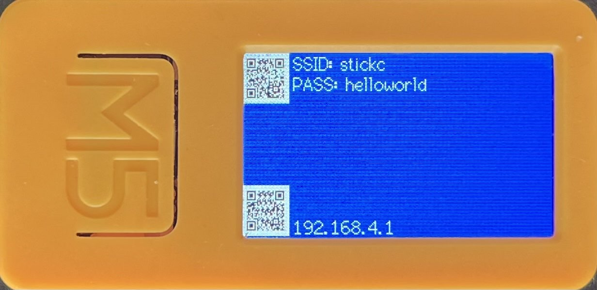
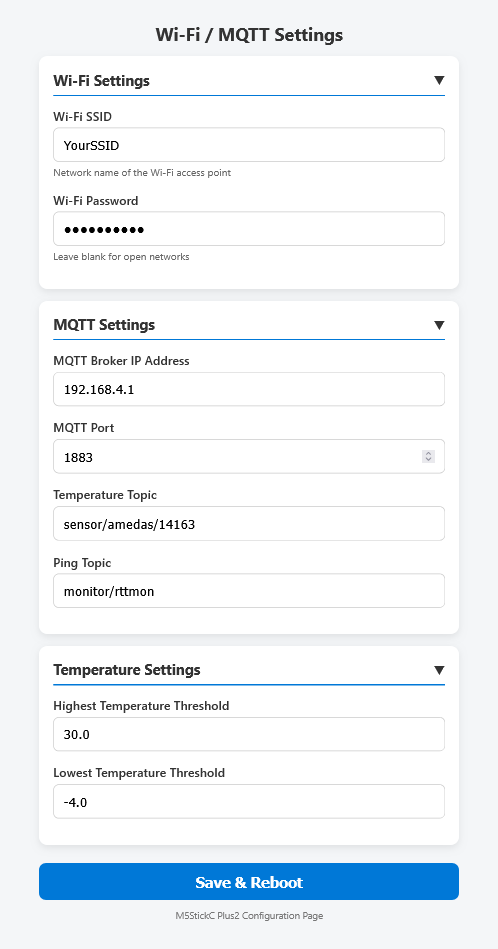

# MQDash

MQDash is an MQTT dashboard application designed for the M5StickC Plus2 device. Its primary purpose is to connect to an MQTT broker, monitor temperature data and network ping loss from multiple hosts on the device's screen. It serves as a portable monitoring tool for IoT environments, providing visual feedback on environmental conditions and network health.



## Main Features and Characteristics

- **MQTT Client**: Subscribes to MQTT topics for temperature readings and ping monitoring data.
- **Real-time Dashboard**: Displays temperature ranges (lowest and highest) and ping loss graphs for up to 4 hosts using an LRU (Least Recently Used) management system.
- **Visual Alerts**: Changes background color when temperature thresholds are exceeded.

  

## Usage

After installation and initial configuration:

1. Power on the M5StickC Plus2.
2. If no configuration exists, it will create a WiFi access point named "stickc" with password "helloworld".

   

3. Connect to this access point and access the web interface at `http://192.168.4.1` to configure WiFi and MQTT settings.

   

4. Once configured, the device will connect to your WiFi network and MQTT broker.
5. The dashboard will display temperature data and ping loss graphs in real-time.

## MQTT Topics and Payload Formats

The device subscribes to two MQTT topics configured during setup: a temperature topic and a ping topic. The topic names are user-configurable via the web configuration interface and stored in the device's preferences. There are no default topic names; they must be set during initial configuration.

### Temperature Topic

- **Purpose**: Receives temperature monitoring data.
- **Payload Format**:

  ```json
  {
    "lowest": 15.5,
    "highest": 25.3,
    "report_datetime": "2023-10-01T12:00:00Z"
  }
  ```

  - `lowest`: Float value representing the lowest temperature recorded.
  - `highest`: Float value representing the highest temperature recorded.
  - `report_datetime`: String representing the timestamp of the report in ISO 8601 format.

### Ping Topic

- **Purpose**: Receives network ping monitoring data for multiple hosts.
- **Payload Format**:

  ```json
  {
    "anomalies": [
      {
        "host": "192.168.1.1",
        "anomaly": {
          "PacketLoss": 5.2
        }
      },
      {
        "host": "192.168.1.2",
        "anomaly": {
          "PacketLoss": 0.0
        }
      }
    ]
  }
  ```

  - `anomalies`: Array of objects, each containing:
    - `host`: String representing the host IP or name.
    - `anomaly`: Object containing:
      - `PacketLoss`: Float value representing the packet loss percentage (0.0 to 100.0).

## Dependencies

- M5Unified: Unified library for M5Stack devices
- PubSubClient: MQTT client library for Arduino
- ArduinoJson: JSON parsing library

## License

This project is licensed under the MIT License.
